# 🧠 Quiz Game – Jogo de Perguntas e Respostas

### Um jogo web de perguntas e respostas com sistema de cadastro, autenticação, criação de partidas personalizadas, pontuação e pesquisa por nome ou ID. Ideal para desafiar amigos, se divertir e competir por pontos!

## 🚀 Funcionalidades

    👤 Cadastro e login de usuários com armazenamento de pontuação adquirida a partir dos acertos em uma partida

    🏠 Tela home com campo de busca para os jogos cadastrados por todos os usuários (pesquisa por nome ou código do quiz) e score total do usuário

    📝 Criação de quizzes com:

        -Até 20 perguntas personalizadas

        -Upload de imagem ilustrativa

        -Quatro alternativas (uma correta)

    🔗 Compartilhamento dos jogos cadastrados

## 🖼️ Prints demonstrando o funcionamento do projeto

### 📸 Tela de Login:

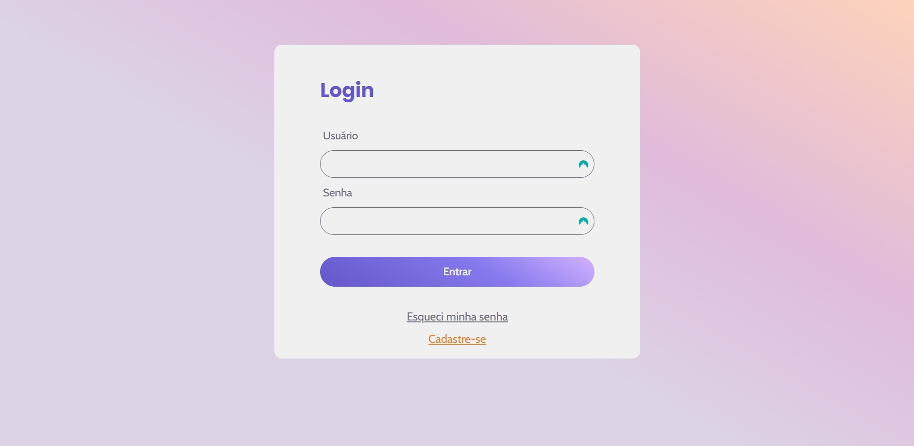

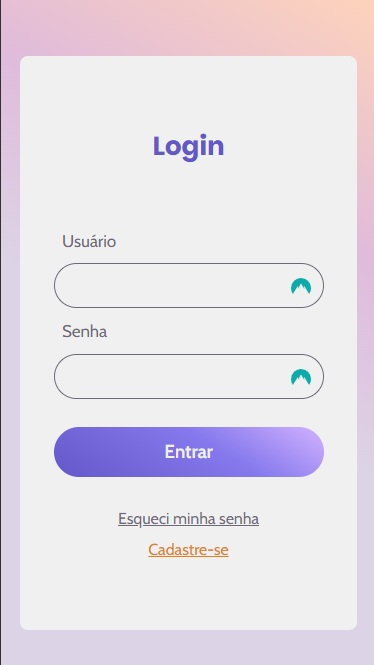

### 📸 Tela home:

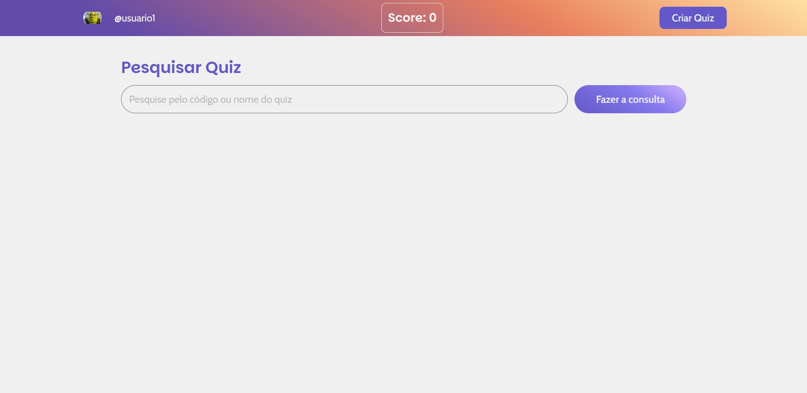

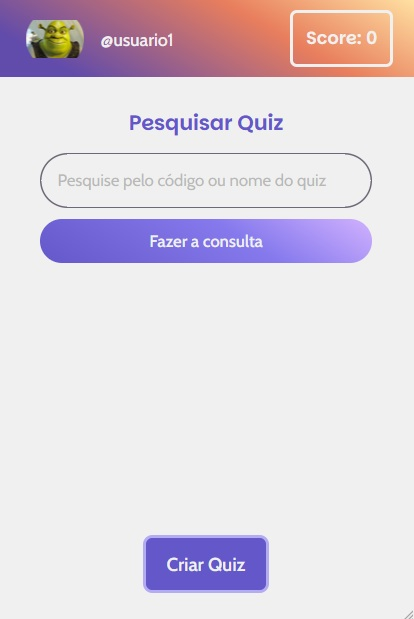

### 📸 Jogador cadastrando um quiz:

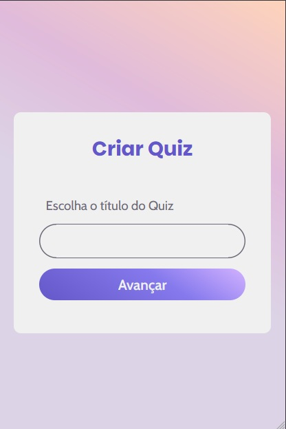

### 📸 Adicionando as perguntas:
Ao adicionar todas as perguntas desejadas basta clicar em "Finalizar quiz"

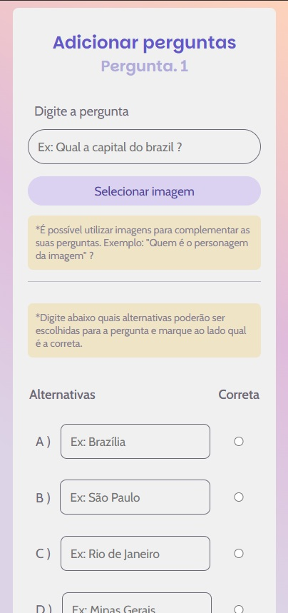

### 📸 Buscando um quiz:

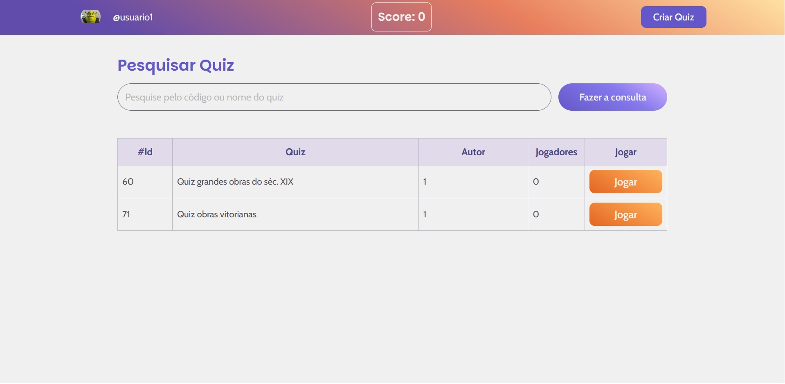

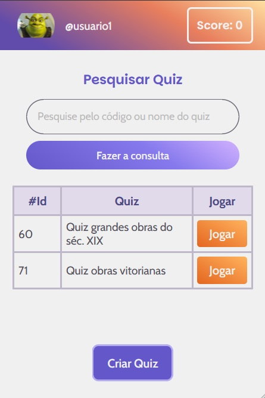

### 📸 Jogo em andamento:

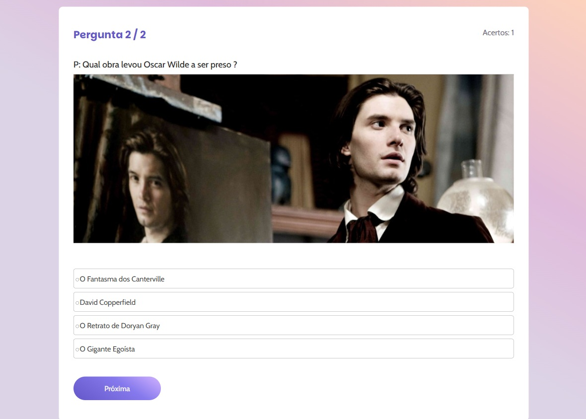

### 📸 Partida encerrada - pontuação:

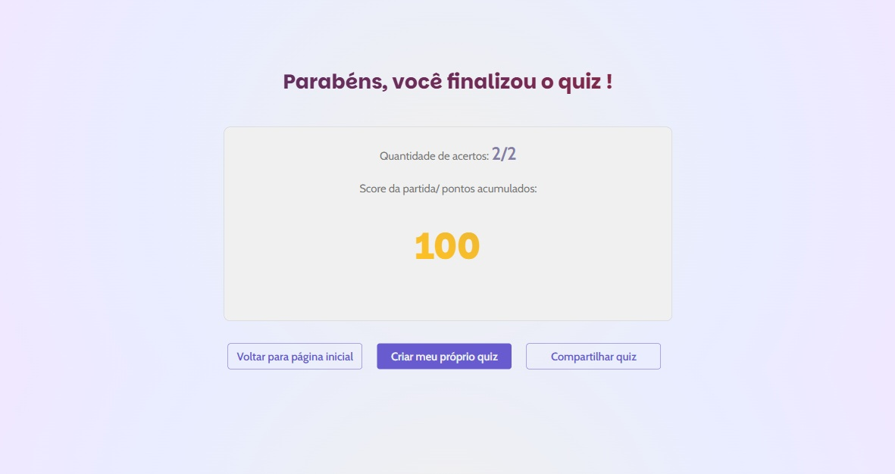

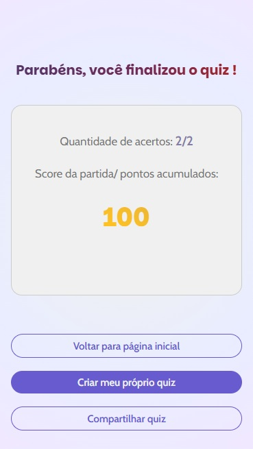

# 🛠️ Tecnologias utilizadas

    -PHP (backend)

    -MySQL (banco de dados)

    -HTML, CSS, JavaScript

    -Fetch API para interações dinâmicas

    -Git & GitHub para controle de versão